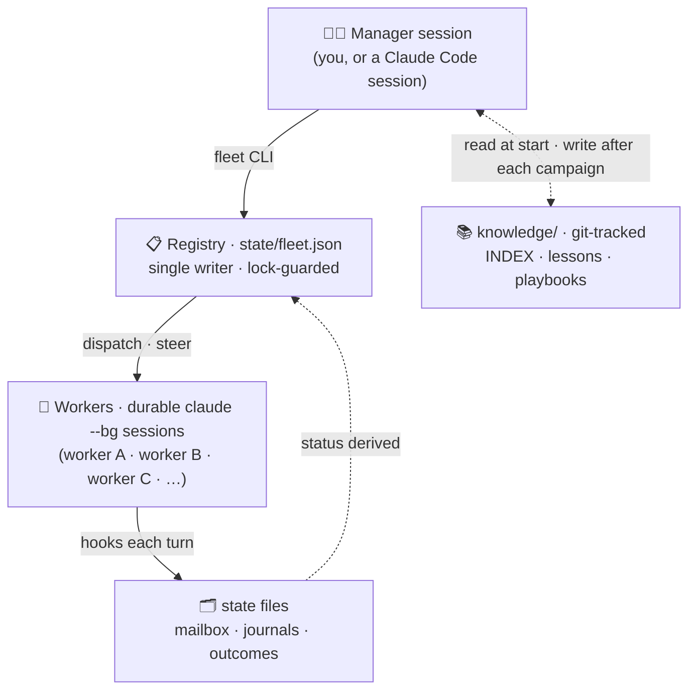

# claude-fleet

**Run a whole team of Claude Code sessions from one seat.** One manager session spawns, steers, and hands off many headless worker sessions across every project on your machine — days-long, multi-project campaigns without babysitting a terminal.

   -lightgrey) 

Workers aren't fire-and-forget processes — they're **durable Claude Code sessions on disk**. They survive crashes, reboots, and the manager's own death. You can steer one mid-turn, drop into any of them for a live interactive hand-off, reset one's context while keeping its work journal, or park one that hit a usage limit and resume it later. It's a single-file, stdlib-only Python CLI plus a few hooks — no daemon of its own, no framework, no dependencies.

📖 **[How it works](docs/concepts.md)** · 🚀 **[Getting started](docs/getting-started.md)** · 🗺️ **[Roadmap](docs/ROADMAP.md)** · 📚 **[All docs](docs/README.md)** · 📐 **[Spec](docs/SPEC.md)**

---

## See it in action

```console
$ fleet spawn migrate-users --dir C:\proga\billing-service --mode bypass \
    --task "Port the users table migration from Knex to raw SQL, see MIGRATION.md" \
    --token-ceiling 200000
migrate-users a1b2c3d4-... (native bg, short id a1b2c3d4)

$ fleet status
NAME                STATUS       TURNS     COST      AGE  MAIL  FLAGS
migrate-users        working         1      0.00       2m     0  -

$ fleet send migrate-users "also add a down-migration, I forgot to ask"
migrate-users: turn running -- message queued to mailbox

$ fleet peek migrate-users
[tool] Read MIGRATION.md
[tool] Write migrations/0042_users.sql
[mail] delivered: "also add a down-migration, I forgot to ask"
[tool] Write migrations/0042_users.down.sql
[assistant] Added the down-migration and re-ran the local suite; both pass.

$ fleet result migrate-users
Migrated 0042_users to raw SQL with a matching down-migration. Ran
`npm test -- migrations` locally: 14 passed. Diff is 2 files, no schema drift.
```

One task, one worker, one budget cap, mid-turn steering — and never once attached a terminal. That's the whole loop.

## Why this exists

Claude Code ships its own background agents (`claude --bg`, `claude agents`) — spawn, list, monitor. Great primitives. What they *don't* give you is the operator layer on top:

- a **named registry** with per-task permission modes,
- **mid-turn mailbox steering** without attaching,
- **journals + respawn** so a worker's context can reset without losing its work,
- **budget and token ceilings** enforced before every turn,
- a **durable manager identity** that survives restarts and hands off cleanly,
- and a **knowledge base that gets smarter every campaign.**

`claude-fleet` is exactly that layer — riding *on top of* Claude Code's native background-agent substrate, not reinventing it.

## The idea in one line

**State is plain files + a CLI. Every surface is a disposable view.**

The registry, mailboxes, journals, and knowledge live on disk. The statusline, the `/fleet:*` slash commands, the manager session, the SessionStart briefing — all just *read the same files*. Add or drop a surface without touching the core. No surface owns data; no view ever probes a PID, takes a lock, or writes.



Every `fleet` command is a short-lived CLI invocation. The registry is the single source of truth every view derives from — never independent state. **See it all explained with diagrams: [How claude-fleet works →](docs/concepts.md)**

## Features — shipped, not aspirational

| | |
|---|---|
| **Mid-turn steering** | `fleet send` drops a message into a running worker's mailbox; injected at the next tool boundary, no attach required. |
| **Token caps** | `--token-ceiling` is enforced fleet-side before every resume turn — a worker that would blow its cap refuses to continue. |
| **Respawn with journal continuity** | `fleet respawn` gives a worker a fresh session (new context, same name/cwd/mode) while carrying its journal and drained mailbox forward — the context-reset lever for long campaigns. |
| **Usage-limit park/resume** | A worker that hits a Claude plan usage limit parks itself (`limited` status, recorded reset horizon) instead of dying silently; `fleet resume-limited` relaunches it once the window passes. |
| **Durable manager identity** | A boot-claim + heartbeat + hand-off protocol (`fleet sup-boot` / `sup-handoff-*`) so exactly one manager owns the fleet across restarts — and can pass the baton to a successor without dropping a campaign. |
| **Knowledge loop** | `knowledge/` is git-tracked: an index, playbooks, per-project quirks, and append-only lessons that every manager session reads at startup and writes back to after every campaign. The fleet gets better at running the fleet. |
| **`fleet doctor`** | 21 health checks in one command — hook wiring, stale sessions, orphaned mailboxes, stale attaches, version pins, autoclean scheduler state, supervisor claim, and more. |
| **Terminal surface** | Statusline + `/fleet:*` slash commands + SessionStart briefing, shipped as a normal Claude Code plugin. Fleet state visible without typing a command. |
| **Interactive hand-off** | `fleet attach` opens a worker's actual session in its own terminal; `fleet release` hands it back to headless operation. |
| **Crash-safe by design** | A worker is a durable Claude Code session addressed by `--session-id`/`--resume`, not a process fleet has to keep alive. Fleet runs no persistent process of its own — every `fleet` command is a short-lived CLI invocation. |

## Quickstart

**Runs today on:** Windows 10+, PowerShell, Git Bash, Python via `py -3.13`, Claude Code CLI `2.1.202+`. Cross-platform (Linux/macOS) is fully specced and `ready-for-build` ([`docs/specs/portability.md`](docs/specs/portability.md)) — not yet shipped.

```powershell
# 1. Clone, add bin\ to PATH  (bin\ holds fleet.cmd)
git clone https://github.com/exPardus/fleet.git

# 2. Render machine-local hook wiring
fleet init

# 3. Install the plugin (manager skill, /fleet:* commands, SessionStart briefing)
claude plugin marketplace add <path-or-github-repo-of-this-clone>
claude plugin install fleet@claude-fleet
#    restart Claude Code, verify: claude plugin details fleet

# 4. Optional: the always-on statusline (a plugin can't ship one)
fleet init --statusline
```

Then open a Claude Code session, say *"become the fleet manager"*, and spawn your first worker. Full install detail — collaborator/multi-machine setup, the `--statusline --chain` composition flag — is in [`docs/SPEC.md`](docs/SPEC.md).

## CLI

| Command | Purpose |
|---|---|
| `fleet init` | Render machine-local `worker-settings.json` from the template |
| `fleet spawn` | Spawn a new worker session |
| `fleet status` | Show the worker status table |
| `fleet peek` | Digest of recent stream events (works mid-turn) |
| `fleet result` | Final result text of the last completed turn |
| `fleet wait` | Block until turn(s) end |
| `fleet send` | Steer a worker (mailbox mid-turn, or a new turn if idle) |
| `fleet interrupt` | Stop a worker's running turn |
| `fleet attach` / `release` | Attach an interactive terminal / hand it back to idle |
| `fleet respawn` | Fresh session for a worker (the context-reset lever) |
| `fleet resume-limited` | Relaunch workers parked on a usage limit past their reset horizon |
| `fleet kill` | Interrupt (if running) and mark a worker dead |
| `fleet clean` / `archive` / `autoclean` | Tiered cleanup: remove dead workers, archive terminal ones, scheduled staleness sweep |
| `fleet doctor` | Run the 21 fleet health checks |
| `fleet sup-*` | Supervisor identity: `boot`, `heartbeat`, `checkpoint`, `status`, `handoff-{begin,complete,abort}` |

## Roadmap

Shipped: core lifecycle (spawn/steer/attach/respawn/knowledge), the terminal surface (statusline, slash commands, plugin), native background-agent dispatch, and a durable supervisor identity with hand-off. Specced and ready-for-build: cross-platform portability. Ahead: a watchtower for continuous monitoring, a Telegram bridge, a local web UI, and a "trust ledger" intelligence layer. Every phase is gated behind a real-usage soak, not a calendar date. Full detail: [`docs/ROADMAP.md`](docs/ROADMAP.md).

## Why you can trust it

This repo attacks its own work before it ships. Every spec and code change runs an adversarial-review pass with receipts — real bugs caught past green tests, five-hostile-pass spec reviews, live-repro authority. It's all public in [`docs/reviews/`](docs/reviews/) and the accumulated postmortems in [`knowledge/lessons.md`](knowledge/lessons.md). If you want to see the process actually work, start with `docs/reviews/c2-review-adversarial.md` (a HIGH-severity double-launch bug found behind a passing suite).

<details>
<summary><b>Under the hood: the native-substrate pivot</b></summary>

Fleet originally hosted worker processes itself (detached launch + PID/ctime liveness probes). It now hands process hosting and liveness to Claude Code's own background-agent daemon (`claude --bg`, the agents menu) and keeps only the semantic layer — mailbox steering, budgets, journals, the supervisor, the knowledge loop — on top. This shipped end-to-end and is pin-verified against the live daemon:

```
FLEET_LIVE=1 pytest tests/integration/test_native_pin.py
```

Design: [`docs/superpowers/specs/2026-07-13-native-agents-pivot-design.md`](docs/superpowers/specs/2026-07-13-native-agents-pivot-design.md).
Contract: [`docs/specs/native-substrate.md`](docs/specs/native-substrate.md).
Because the daemon is a moving target, the pin suite re-runs on every `claude` version bump — see the pin gate in `fleet doctor`.

</details>

## Docs

| Doc | For |
|---|---|
| **[How claude-fleet works](docs/concepts.md)** | The idea, the problem, and the mechanics — with diagrams. Start here. |
| **[Getting started](docs/getting-started.md)** | Install → become the manager → run your first campaign. |
| **[Roadmap](docs/ROADMAP.md)** | What's shipped, what's next, and the soak-gate discipline behind each phase. |
| **[SPEC.md](docs/SPEC.md)** | The architecture of record: registry schema, load-bearing invariants, every command's contract. |
| **[Docs index](docs/README.md)** | Every doc in the repo, tagged by audience (users / contributors / internal). |

Not sure where to look? The [docs index](docs/README.md) tags every file by audience.

## Contributing

See [`CONTRIBUTING.md`](CONTRIBUTING.md).

## License

[MIT](LICENSE) © exPardus
