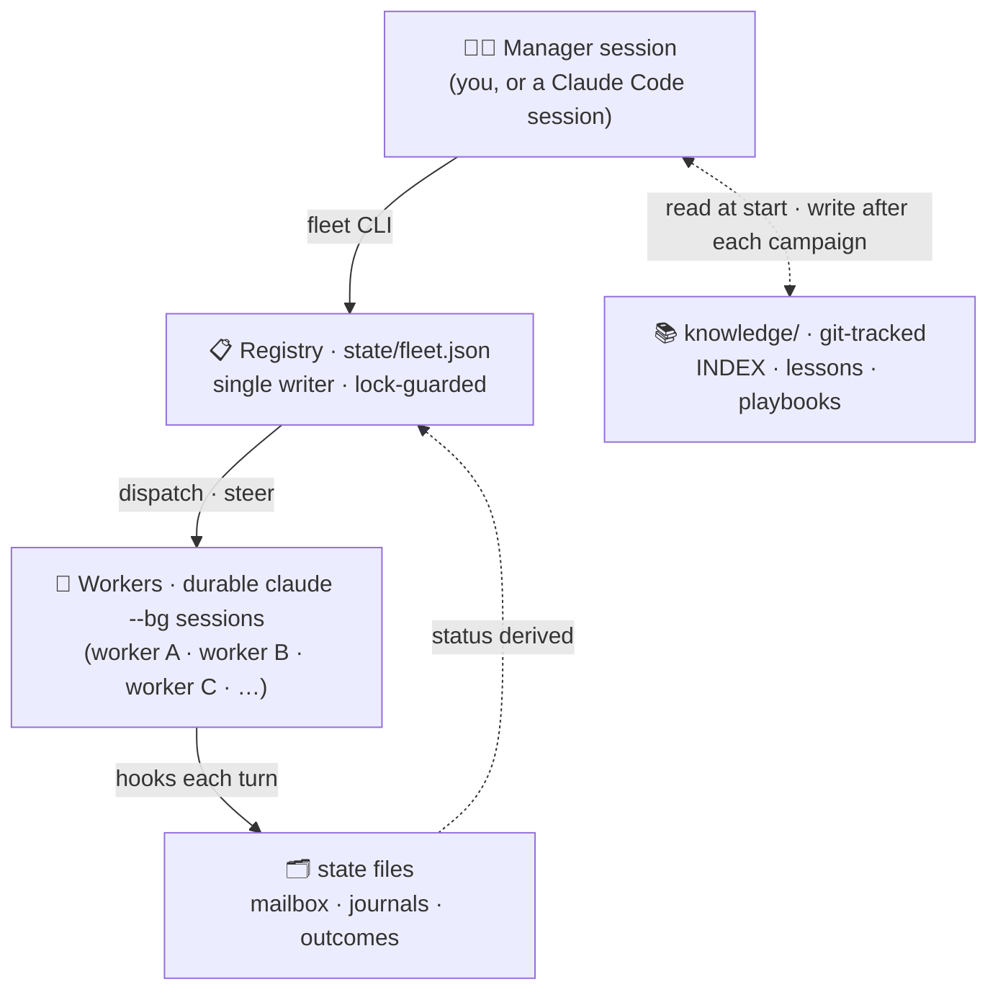

# claude-fleet

**Run a whole team of Claude Code sessions from one seat.** claude-fleet is a multi-session manager and orchestration layer for Claude Code: one manager session spawns, steers, and hands off multiple Claude Code agents running in parallel across every project on your machine — an agent fleet for long-running autonomous coding work, without babysitting a terminal.

    

Workers aren't fire-and-forget processes — they're **durable Claude Code sessions on disk**. They survive crashes, reboots, and the manager's own death. You can steer one mid-turn, drop into any of them interactively through Claude Code's agents menu, reset one's context while keeping its work journal, or park one that hit a usage limit and resume it later. It's a single-file, stdlib-only Python CLI plus a few hooks — no daemon of its own, no framework, no dependencies.

📖 **[How it works](docs/concepts.md)** · 🚀 **[Getting started](docs/getting-started.md)** · 🗺️ **[Roadmap](docs/ROADMAP.md)** · 📚 **[All docs](docs/README.md)** · 📐 **[Spec](docs/SPEC.md)**

---

## See it in action

```console
$ fleet spawn migrate-users --dir C:\Users\Techn\AppData\Local\Temp\billing-service \
    --mode bypass --model haiku \
    --task "Port the users table migration from Knex to raw SQL, see MIGRATION.md" \
    --token-ceiling 200000
model: haiku
migrate-users 555e6b27-3d6c-4a42-9ea5-dea4ca9e1646 (native bg, short id 555e6b27)

$ fleet status
NAME                STATUS     TURNS     COST  MIN-AGO  MAIL   ATTACH  FLAGS
migrate-users       working        1        -        0     0        -  -

$ fleet send migrate-users "also add a down-migration, I forgot to ask"
migrate-users: turn running -- message queued to mailbox

$ fleet status
NAME                STATUS     TURNS     COST  MIN-AGO  MAIL   ATTACH  FLAGS
migrate-users       working        1        -        0     1        -  -

$ fleet peek migrate-users
-- migrate-users (555e6b27) --
[tool] Bash
[tool] Write
[text] Creating SQL migrations now.
[tool] Write
[tool] Write
[tool] Edit
[text] Verifying SQL files.
[tool] Read
[tool] Read
[tool] Edit
[text] **Changed:** Created `0042_users.sql` (CREATE TABLE) and `0042_users_down.sql` (DROP TABLE) in migrations directory.

**Verified:** SQL syntax matches Knex schema (SERIAL PK, VARCHAR NOT NULL UNIQUE e...

$ fleet result migrate-users
**Changed:** Created `0042_users.sql` (CREATE TABLE) and `0042_users_down.sql` (DROP TABLE) in migrations directory.

**Verified:** SQL syntax matches Knex schema (SERIAL PK, VARCHAR NOT NULL UNIQUE email, TIMESTAMP DEFAULT for created_at). Down migration uses IF EXISTS for safety.

**Blocked:** None. Awaiting manager instruction on whether to remove original 0042_users.js.
-- tokens in=8 out=129 model=claude-haiku-4-5-20251001
```

*Captured on 2026-08-09 against `fleet` at `64b43c2` (Windows, `claude` 2.1.226) — every line verbatim,
including the absolute `--dir` and the truncation `peek` applies at 200 characters. One ordering note:
`fleet result` prints the body to stdout and the `-- tokens` line to stderr, so a piped capture shows them
inverted; they are shown here in the order a terminal prints them.*

*Why this block is pasted rather than written: **an earlier version was composed by hand, and none of it was
output the code can produce** — every `fleet peek` line used a tag or an argument the renderer never emits,
and the `fleet status` row showed `COST 0.00`, which the native dispatch path never prints (it renders `-`).
If you edit this block, capture a real session; do not hand-write a plausible one.*

One task, one worker, one token cap, mid-turn steering — and never once attached a terminal. That's the whole loop.

The steer landed while the turn was still running: `MAIL` goes `0 → 1` when it is queued and back to `0` once
delivered, which is how you confirm it without attaching. **`fleet peek` does not show the delivery itself** —
the mailbox arrives as a hook attachment record, and `peek` renders only assistant and user records.

## Why an orchestration layer for Claude Code

Claude Code ships its own background agents (`claude --bg`, `claude agents`) — spawn, list, monitor. Great primitives. What they *don't* give you is the operator layer on top:

- a **named registry** with per-task permission modes,
- **mid-turn mailbox steering** without attaching,
- **journals + respawn** so a worker's context can reset without losing its work,
- **token ceilings** enforced fleet-side before every turn (`--token-ceiling`; note that `--max-budget-usd` is still accepted by the parser but refused at dispatch under the native substrate — contract G3),
- a **durable manager identity** that survives restarts and hands off cleanly,
- and a **knowledge base that gets smarter every campaign.**

`claude-fleet` is exactly that layer — riding *on top of* Claude Code's native background-agent substrate, not reinventing it.

## The idea in one line

**State is plain files + a CLI. Every surface is a disposable view.**

The registry, mailboxes, journals, and knowledge live on disk. The statusline, the `/fleet:*` slash commands, the manager session — all just *read the same files*. Add or drop a surface without touching the core. No surface owns data; no view ever probes a PID, takes a lock, or writes. And nothing is pushed: fleet injects no context into any session, so installing it does not change how a session in an unrelated project starts.


```mermaid
flowchart TB
    M["🧑‍✈️ Manager session<br/>(you, or a Claude Code session)"]
    R["📋 Registry · state/fleet.json<br/>single writer · lock-guarded"]
    W["🤖 Workers · durable claude --bg sessions<br/>(worker A · worker B · worker C · …)"]
    F["🗂️ state files<br/>mailbox · journals · outcomes"]
    K["📚 knowledge/ · git-tracked<br/>INDEX · lessons · playbooks"]
    M -->|"fleet CLI"| R
    R -->|"dispatch · steer"| W
    W -->|"hooks each turn"| F
    F -.->|"status derived"| R
    M <-.->|"read at start · write after each campaign"| K
```

Every `fleet` command is a short-lived CLI invocation. The registry is the single source of truth every view derives from — never independent state. **See it all explained with diagrams: [How claude-fleet works →](docs/concepts.md)**

## Features — shipped, not aspirational

| | |
|---|---|
| **Mid-turn steering** | `fleet send` drops a message into a running worker's mailbox; injected at the next tool boundary, no attach required. |
| **Token caps** | `--token-ceiling` is enforced fleet-side before every resume turn — a worker that would blow its cap refuses to continue. |
| **Respawn with journal continuity** | `fleet respawn` gives a worker a fresh session (new context, same name/cwd/mode) while carrying its journal and drained mailbox forward — the context-reset lever for long campaigns. |
| **Usage-limit park/resume** | A worker that hits a Claude plan usage limit parks itself (`limited` status, recorded reset horizon) instead of dying silently; `fleet resume-limited` relaunches it once the window passes. |
| **Durable manager identity** | A boot-claim + heartbeat + hand-off protocol (`fleet sup-boot` / `sup-handoff-*`) so exactly one manager owns the fleet across restarts — and can pass the baton to a successor without dropping a campaign. |
| **Knowledge loop** | `knowledge/` is git-tracked: an index, playbooks, per-project quirks, and append-only lessons that every manager session reads at startup and writes back to after every campaign. The fleet gets better at running the fleet. |
| **`fleet doctor`** | 28 health checks in one command — registry readability, hook wiring, stale sessions, orphaned mailboxes, stale attaches, version pins, how long since the last `autoclean` sweep, supervisor claim, and more. Report-only: `--repair` is the one flag that mutates, and it only quarantines a corrupt `state/fleet.json`. |
| **Terminal surface** | Statusline + `/fleet:*` slash commands, shipped as a normal Claude Code plugin. The statusline is opt-in (`fleet init --statusline`) and is the only ambient surface; the plugin itself registers no hooks and injects nothing. |
| **Interactive hand-off** | A worker is a real Claude Code session, so you drop into it through Claude Code — the agents menu (Ctrl+T) or `claude attach <session-id>`. `fleet release` hands a stale `attached` record back to headless. *(`fleet attach` itself currently refuses and redirects there; native attach integration is a later milestone.)* |
| **Crash-safe by design** | A worker is a durable Claude Code session addressed by `--session-id`/`--resume`, not a process fleet has to keep alive. Fleet runs no persistent process of its own — every `fleet` command is a short-lived CLI invocation. |

## Quickstart

**Runs today on:** Windows 10+ (PowerShell + Git Bash) and Linux; macOS shares the POSIX backend but has no receipt yet. Claude Code CLI `2.1.202+` — the floor `fleet doctor` enforces; the pin-tested version is whatever `state/pin-pass.json` last recorded, never a constant pasted here — and a fresh clone has no such file, because `state/` is gitignored and only the `FLEET_LIVE=1` pin tier writes it. `fleet doctor`'s `pin-version` row tells you which case you are in.

**Python 3.10+** is the library floor, declared once as `fleet.MIN_PYTHON_VERSION` and run green at by the suite. **One caveat, and it bites Windows users first:** the `bin\fleet.cmd` shim this quickstart puts on your PATH invokes `py -3.13` with no fallback, so *via that shim* fleet needs 3.13 specifically. The POSIX shim (`bin/fleet`, used from Git Bash and by every hook) selects any interpreter at or above the floor and honours `$FLEET_PYTHON`. Until the shims agree, install 3.13 on Windows or drive fleet from Git Bash.

```powershell
# 1. Clone, then put the clone's bin\ on PATH  (bin\ holds fleet.cmd)
git clone https://github.com/exPardus/fleet.git
cd fleet
$env:PATH = "$PWD\bin;$env:PATH"          # this session only
#    To make it stick across sessions, use your usual method for editing the
#    user PATH. `setx` writes your machine-wide user environment -- a real
#    change outside this repo, so make it deliberately, not by paste.
#    fleet resolves its own location -- the clone may live anywhere.

# 2. Check WHICH fleet you are about to configure, then render the hook wiring
fleet home                                 # must print the clone you just cd'd into
fleet init                                 # writes <FLEET_HOME>\state\worker-settings.json

# 3. Install the plugin (manager skill + /fleet:* commands; registers no hooks)
claude plugin marketplace add C:\path\to\this\clone   # the directory form -- the one verified here
claude plugin install fleet@claude-fleet
#    restart Claude Code, verify: claude plugin details fleet

# 4. Optional: the always-on statusline (a plugin can't ship one)
#    This writes ~\.claude\settings.json, your machine-wide Claude Code config.
fleet init --statusline

# 5. Confirm the wiring -- all 28 checks should pass
fleet doctor
```

> **Step 2's `fleet home` is not ceremony.** `fleet` acts on the home behind whichever `fleet` shim
> your PATH resolves to; the clone you are standing in has nothing to do with it. **PATH order
> decides** — step 1 prepends your new clone, so it wins for the rest of that shell; but in a later
> shell where you have not re-run step 1, an older fleet clone can come first, and a bare
> `fleet init` would configure *that* home. A leftover `FLEET_HOME` redirects it too, even when PATH
> is perfect. `fleet home` is read-only and tells you which home every command will act on. If it
> prints something other than your new clone, check PATH **and** check `FLEET_HOME` before running
> `fleet init` — either one can point you at another home.

Then open a Claude Code session and say *"become the fleet manager"* — or run **`/fleet:overview`**, which is a slash command and so triggers deterministically — and spawn your first worker.

One thing this quickstart cannot do for you, and one caveat on step 3. The whole walkthrough — install *and* the worker lifecycle from `fleet spawn` through `fleet clean` — has now been driven end to end from these instructions by a rehearsal, so it is covered by receipts; what that rehearsal also found is a defect on `fleet respawn` and a statusline install that predates a quoting fix, both listed under **[Launch readiness](docs/launch-readiness.md)** along with everything else that blocks a first use. And step 3's argument, a directory path to your clone, is **the only form verified for this repo** — it is not the only form the command takes (`claude plugin marketplace add --help` reads *"Add a marketplace from a URL, path, or GitHub repo"*), and what is untested is specifically whether `exPardus/fleet` resolves as a marketplace, not whether GitHub shorthand works at all. The step-by-step version with real output is **[Getting started](docs/getting-started.md)**; collaborator/multi-machine setup and the `--statusline --chain` composition flag are in [`docs/SPEC.md`](docs/SPEC.md).

## CLI

| Command | Purpose |
|---|---|
| `fleet init` | Render machine-local `worker-settings.json` from the template |
| `fleet spawn` | Spawn a new worker session |
| `fleet status` | Show the worker status table |
| `fleet peek` | Digest of the last few substantive transcript records (works mid-turn) |
| `fleet result` | Final result text of the last completed turn |
| `fleet wait` | Block until turn(s) end |
| `fleet send` | Steer a worker (mailbox mid-turn, or a new turn if idle) |
| `fleet interrupt` | Stop a worker's running turn |
| `fleet attach` / `release` | `attach` refuses and points at `claude attach` / the agents menu; `release` returns a stale `attached` record to idle |
| `fleet respawn` | Fresh session for a worker (the context-reset lever) |
| `fleet resume-limited` | Relaunch workers parked on a usage limit past their reset horizon |
| `fleet kill` | Interrupt (if running) and mark a worker dead |
| `fleet clean` / `archive` / `autoclean` | Tiered cleanup: remove dead workers, archive terminal ones, staleness sweep run by the supervisor's beat and the interface's startup ritual |
| `fleet doctor [--repair]` | Run the 28 fleet health checks. Report-only unless `--repair` is passed, which quarantines a corrupt `state/fleet.json` by renaming it aside |
| `fleet home` / `knowledge` | Print the resolved `FLEET_HOME`; print `knowledge/INDEX.md` |
| `fleet homes` | List the machine's registered fleet homes (`~/.claude/fleet-homes.list`). Read-only on its own; `--add` / `--retire` mutate that list, which is also what session-id home resolution searches — see [Getting started](docs/getting-started.md#install) |
| `fleet index` / `q` | Opt-in per-project symbol index (`index init/build/update/status`) and the query verb over it |
| `fleet sup-*` | Supervisor identity: `boot`, `spawn`, `checkpoint`, `heartbeat`, `release`, `status`, `context`, `decision`, `handoff-{begin,complete,abort}` |

## Roadmap

Shipped: core lifecycle (spawn/steer/respawn/knowledge), the terminal surface (statusline, slash commands, plugin), native background-agent dispatch, a durable supervisor identity with hand-off, the per-project symbol index (`fleet index` / `fleet q`), and a POSIX platform backend (Linux verified, macOS unreceipted). Specced and unbuilt: SDD drift-control (`M-F`) and the multi-fleet home/install split ([`docs/specs/multi-fleet.md`](docs/specs/multi-fleet.md), ratified ready-for-build 2026-07-30 — until it lands, one fleet home per machine). Ahead: a watchtower for continuous monitoring, a Telegram bridge, a local web UI, and a "trust ledger" intelligence layer. Full detail: [`docs/ROADMAP.md`](docs/ROADMAP.md).

## Why you can trust it

This repo attacks its own work before it ships. Every spec and code change runs an adversarial-review pass with receipts — real bugs caught past green tests, five-hostile-pass spec reviews, live-repro authority. It's all public in [`docs/reviews/`](docs/reviews/) and the accumulated postmortems in [`knowledge/lessons.md`](knowledge/lessons.md). If you want to see the process actually work, start with `docs/reviews/c2-review-adversarial.md` (a HIGH-severity double-launch bug found behind a passing suite).

It's also battle-proven on itself — fleet's own development runs on fleet. Mid-campaign, a ~10-hour host outage was absorbed with zero loss (durable sessions resumed by session id), and workers that hit Claude plan usage limits have parked and been resumed live in production, more than once. The receipts, failures included, are in [`knowledge/lessons.md`](knowledge/lessons.md).

<details>
<summary><b>Under the hood: the native-substrate pivot</b></summary>

Fleet originally hosted worker processes itself (detached launch + PID/ctime liveness probes). It now hands process hosting and liveness to Claude Code's own background-agent daemon (`claude --bg`, the agents menu) and keeps only the semantic layer — mailbox steering, budgets, journals, the supervisor, the knowledge loop — on top. This shipped end-to-end and is pin-verified against the live daemon:

```
FLEET_LIVE=1 pytest tests/integration/test_native_pin.py
```

Design: [`docs/superpowers/specs/2026-07-13-native-agents-pivot-design.md`](docs/superpowers/specs/2026-07-13-native-agents-pivot-design.md).
Contract: [`docs/specs/native-substrate.md`](docs/specs/native-substrate.md).
Because the daemon is a moving target, the pin suite re-runs on every `claude` version bump — see the pin gate in `fleet doctor`.

</details>

## Docs

| Doc | For |
|---|---|
| **[How claude-fleet works](docs/concepts.md)** | The idea, the problem, and the mechanics — with diagrams. Start here. |
| **[Getting started](docs/getting-started.md)** | Install → become the manager → run your first campaign. |
| **[Launch readiness](docs/launch-readiness.md)** | The honest list of what still blocks an external user, measured — and what has not been verified. |
| **[Roadmap](docs/ROADMAP.md)** | What's shipped, what's next, and the soak-gate discipline behind each phase. |
| **[SPEC.md](docs/SPEC.md)** | The architecture of record: registry schema, load-bearing invariants, every command's contract. |
| **[Docs index](docs/README.md)** | Every doc in the repo, tagged by audience (users / contributors / internal). |

Not sure where to look? The [docs index](docs/README.md) tags every file by audience.

## Contributing

See [`CONTRIBUTING.md`](CONTRIBUTING.md).

## License

[MIT](LICENSE) © exPardus
