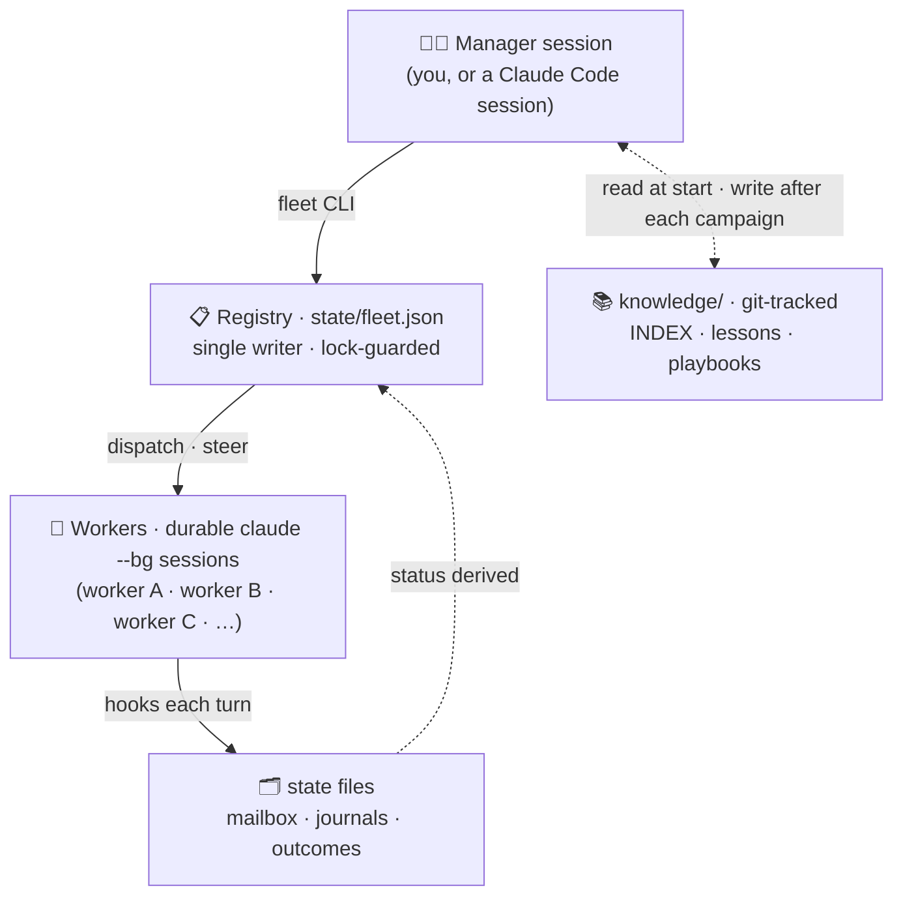
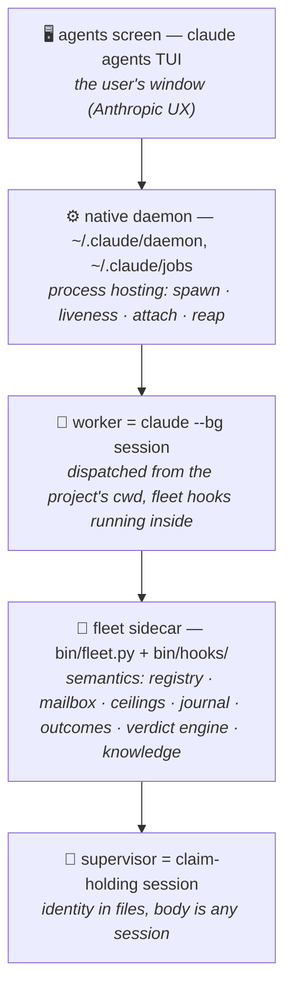
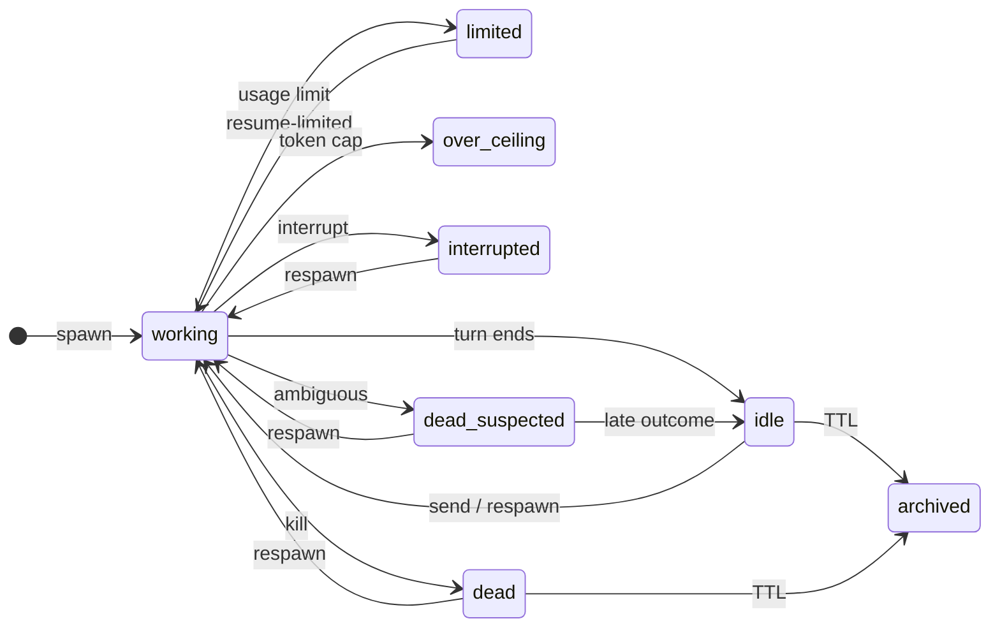
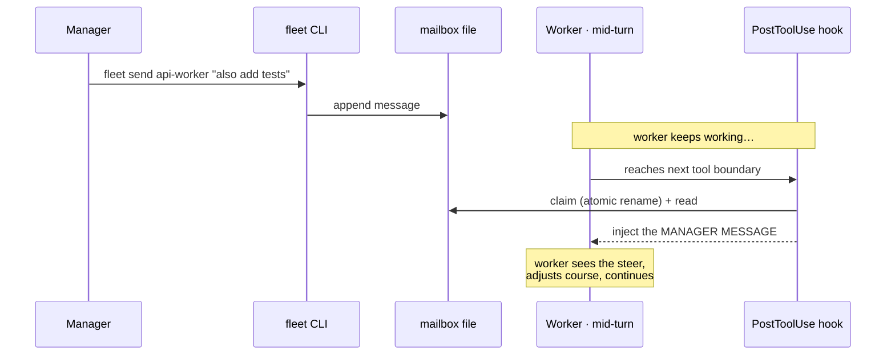
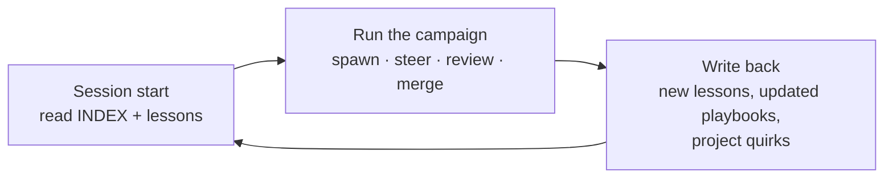

# How claude-fleet works

*The idea, the problem it solves, and the mechanics underneath — for anyone deciding whether to use it, or curious how it's built.*

> New here? Read this top-to-bottom once, then jump to **[Getting started](getting-started.md)**. Changing the code? The binding contract is **[SPEC.md](SPEC.md)**, not this page — this is the friendly version.

---

## The problem

Claude Code is one session at a time. That's the right shape for one task in one repo.

But real work isn't shaped like that. A migration touches three services. A refactor spawns a dozen independent edits. A review pipeline wants one worker writing and another attacking. A backlog of small chores across five projects could all run at once. Do any of this today and you're juggling terminal tabs, copy-pasting context, and losing everything the moment a window closes or a machine reboots.

Claude Code *does* ship background agents — `claude --bg` to dispatch, `claude agents` to list, `claude stop/logs/attach`. Those are solid **process** primitives. What they don't give you is the layer an operator actually needs to run a campaign:

| You want to… | Native `--bg` gives you | What's missing |
|---|---|---|
| Refer to a job by name | a UUID | a **named registry** |
| Run each job at the right trust level | one global flag | **per-task permission modes** |
| Nudge a running job | attach and type | **mid-turn steering, no attach** |
| Stop a runaway | manual watching | **token ceilings enforced per turn** |
| Reset a stuck job without losing its work | start over | **respawn with a work journal** |
| Survive a usage limit | silent death | **park + resume** |
| Keep one owner across reboots | nothing | **a durable manager identity** |
| Get better at running jobs | nothing | **a knowledge loop** |

Fleet is that missing layer.

## The idea, in one line

> **State is plain files + a CLI. Every surface is a disposable view.**

Everything fleet knows lives on disk as plain files: a registry, mailboxes, journals, outcome records, git-tracked knowledge. There is no server holding truth in memory. The statusline, the `/fleet:*` slash commands, the manager's Claude session, the startup briefing — none of them *own* anything. They all read the same files and derive the same picture. Add a surface (a web UI, a Telegram bridge) or drop one, and the core never notices.

Three rules fall out of that bet, and they're load-bearing:

1. **One state, many views.** No surface owns data. The core never depends on any surface.
2. **The daemon is additive, never required by fleet.** Fleet runs no persistent process of its own — every `fleet` command is a short-lived CLI invocation. (Process *hosting* is delegated to Claude's own background-agent daemon; that's Claude's, not fleet's.)
3. **The intelligence is Claude.** Dashboards don't decide anything. A manager Claude Code session does. Surfaces route information to and from that intelligence.

## The mental model

- A **worker** is not a process fleet babysits — it's a durable Claude Code session on disk, addressed by session id. It survives crashes, reboots, and the manager's death.
- A **turn** is one short-lived unit of a worker's work. Workers do short turns, not marathon sessions. Between turns they sit idle, cheap, resumable.
- The **manager** is whoever holds the fleet CLI — usually a Claude Code session that has become the fleet manager (say *"become the fleet manager"* and it reads the manager skill).
- The **registry** (`state/fleet.json`) is the one file that decides truth. Only `bin/fleet.py` ever writes it, under a lock. Everything else reads.

## How it's layered

Fleet doesn't host processes anymore — it rebased onto Claude Code's native background-agent substrate. The daemon owns the *process*; fleet owns the *meaning*.

**The division of labor:**

- **Daemon (Claude's):** spawns the process, tracks whether it's alive, handles attach, reaps it. Fleet never touches `~/.claude/daemon/` directly — it only ever talks to the daemon through the sanctioned `claude` CLI (`--bg`, `agents --json`, `stop`, `logs`, `rm`).
- **Fleet sidecar (fleet's):** everything that makes a bag of processes into a managed fleet — task identity, mailbox steering, token budgets, journals, respawn continuity, outcome capture, archival hygiene, and the knowledge loop.
- **Supervisor:** a long-lived *identity* (files on disk) with a disposable *body* (any Claude session that holds the claim). This is how one — and only one — manager owns the fleet across restarts and hands off cleanly.

## The worker lifecycle

A worker moves through a small set of states. Fleet never guesses liveness by probing a PID — it derives each worker's status from **one roster fetch** (`claude agents --json`) joined with the **outcome store** (what actually finished). That derivation is the *verdict engine*.

> `dead-suspected` is the safety valve: when fleet **can't confirm** a worker is alive or done, it lands here — surfaced and advisory, **never auto-respawned** (respawn re-runs side effects, so resurrection is always your call).

The states that matter day to day:

| Status | Meaning |
|---|---|
| `working` | A turn is running. |
| `idle` | Last turn finished cleanly; ready to steer or respawn. |
| `limited` | Hit a Claude plan usage limit; parked with a recorded reset time instead of dying. |
| `over_ceiling` | Would exceed its fleet-side token cap; refuses to continue. |
| `interrupted` | You stopped its turn. The session lives; it won't auto-resume. |
| `dead-suspected` | Ambiguous — fleet can't confirm alive or done. **Never auto-respawned.** |
| `dead` | Explicitly killed. Only `respawn` brings it back. |
| `attached` | Handed off to an interactive terminal. |
| `archived` | Terminal, past its TTL — frozen history, hidden from the default table. |

Two design choices worth calling out, because they're what makes fleet safe to leave running:

- **Never-demote-unknown.** A worker fleet can't confirm is dead becomes `dead-suspected`, *not* `dead`, and is never auto-respawned. Respawn re-runs side effects, so resurrection is always a human/manager decision.
- **Epoch freeze.** If the roster fetch fails, or comes back empty while a worker was known to be working, fleet treats the whole picture as untrustworthy and **writes nothing** — a daemon restart must never read as "everything died."

## Steering a running worker

The headline feature: change a worker's course mid-turn without ever attaching a terminal.

If the worker is **idle** instead of working, `fleet send` does a *fork-steer*: it resumes the session on a new turn (minting a fresh session id, retiring the old one) with your message delivered as the turn's input. Same command, right behavior either way — you don't have to know or care whether it's mid-turn.

The same hook machinery drives two more surfaces: the **Stop hook** records what each turn produced (the outcome store — fleet's source of truth for "did it finish?"), and the **PostCompact hook** writes a marker into the worker's journal so a context reset leaves a trail.

## The knowledge loop

This is the part competitors don't have. `knowledge/` is a **git-tracked** directory the manager reads at the start of every session and writes back to after every campaign:

- `INDEX.md` — one-line pointers to everything (read first, cheap).
- `lessons.md` — append-only postmortems. What broke, why, what to do differently.
- `playbooks/` — reusable doctrine (e.g. the campaign template, spawn etiquette).
- `projects/` — per-project quirks fleet has learned the hard way.

The effect: the fleet gets better at running the fleet. A mistake made once becomes a lesson that prevents it next time — and because it's git-tracked, that experience is durable, reviewable, and shared across machines.

## Why you can trust it running unattended

Fleet modifies itself. That only works because the project attacks its own work before shipping it: every spec and code change goes through an adversarial-review pass with **receipts** — real bugs caught behind green test suites, five-hostile-pass spec reviews, live-repro authority. It's all public.

- Reviews with receipts: [`reviews/`](reviews/)
- Accumulated postmortems: [`../knowledge/lessons.md`](../knowledge/lessons.md)
- A good first read — a HIGH-severity double-launch bug found behind a passing suite: [`reviews/c2-review-adversarial.md`](reviews/c2-review-adversarial.md)

---

## Where to go next

- **[Getting started](getting-started.md)** — install, become the manager, run your first campaign.
- **[SPEC.md](SPEC.md)** — the architecture of record: registry schema, the numbered load-bearing invariants, every command's exact contract.
- **[ROADMAP.md](ROADMAP.md)** — what's shipped, what's next, and the soak-gate discipline behind each phase.
- **[Docs index](README.md)** — every doc in the repo, tagged by audience.
